# SmartPromptBox Pro

<p align="left">
  <a href="https://github.com/ShirakGevorgyan/SmartPromptBox_Pro/actions/workflows/ci.yml?query=branch%3Amain">
    
  </a>
  <a href="https://github.com/ShirakGevorgyan/SmartPromptBox_Pro/actions/workflows/cd.yml?query=branch%3Amain">
    
  </a>
  <a href="#docker--compose">
    
  </a>
  <a href="./LICENSE">
    
  </a>
</p>


A production‑ready **Telegram bot** powered by LLMs: mood‑aware song/movie recommendations, long‑memory GPT chat, image generation, and a fully automated **CI/CD** pipeline.

> **Languages:** [English](README.md) · [Հայերեն](README_AM.md)


---

## Table of Contents
- [Overview](#overview)
- [Feature Highlights](#feature-highlights)
- [Architecture](#architecture)
- [Tech Stack](#tech-stack)
- [Directory Layout](#directory-layout)
- [Prerequisites](#prerequisites)
- [Configuration (.env)](#configuration-env)
- [Quick Start (Local Python)](#quick-start-local-python)
- [Docker & Compose](#docker--compose)
- [Makefile (optional)](#makefile-optional)
- [Slash Commands](#slash-commands)
- [Testing](#testing)
- [CI (GitHub Actions)](#ci-github-actions)
- [CD (Self‑Hosted)](#cd-selfhosted)
- [DevOps / Ansible Deploy](#devops--ansible-deploy)
- [Screenshots](#screenshots)
- [Data Layer](#data-layer)
- [FSM States](#fsm-states)
- [Health / Smoke](#health--smoke)
- [Middlewares](#middlewares)
- [Security Notes](#security-notes)
- [Versioning & Releases](#versioning--releases)
- [Troubleshooting](#troubleshooting)
- [FAQ](#faq)
- [Roadmap](#roadmap)
- [Contributing](#contributing)
- [License](#license)

---

## Overview
**SmartPromptBox Pro** is a modular Telegram bot focused on practical, high‑quality AI features:
- Pick a **mood** and instantly receive curated **songs, movies, quotes**, and **image prompts**.
- Chat with a **memory‑enabled assistant** backed by a lightweight DB.
- Generate images from simple prompts.
- Ship confidently via a **strict CI** (lint, types, security, tests, builds) and automated **CD**.

---

## Feature Highlights
- **🧠 Mood Assistant** — Select how you feel; the bot suggests:
  - 5 songs, 5 movies, 5 quotes
  - 2 image prompts (+ optional generation)
- **🎵 Songs** — Thematic sets and quick recommendations (YouTube links)
- **🎬 Movies & Series** — Browse by genre/title/mood with rich cards
- **🤖 GPT Chat with Memory** — Conversations stored in SQLite for context persistence
- **🎨 Image Generation** — Create images from textual prompts
- **🧪 Tests** — Unit / integration / e2e + input‑sanitization checks
- **🐳 Dockerized** — Separate dev/prod images and Compose files, with healthchecks
- **⚙️ CI/CD (GitHub Actions)** — ruff + mypy + pip‑audit + unit tests + Docker build + Compose smoke; Telegram notifications

---

## Architecture
**High‑level components**
- `telegram_bot/` — aiogram v3 application (routers, handlers, keyboards)
- `llm/` — LLM adapters (mood inference, songs/movies/series pickers, image generation)
- `data/` — DB models and lightweight persistence for chat memory
- `utils/` — cross‑cutting helpers (retry, summarization, logging)
- `devops/` — Dockerfiles, Compose stacks, and Ansible deployment scripts

**Typical request flow**
1. User taps a menu button (e.g., *Mood Assistant*).
2. Handler validates input → calls LLM with retries or a curated provider.
3. Response is formatted (cards, lists, buttons) and sent to Telegram.
4. For chat, messages are appended to **UserMemory** and summarized when needed.

---

## Tech Stack
- **Python 3.10**, **aiogram 3**, **OpenAI API**
- **SQLAlchemy + SQLite** (file‑backed, mounted in Docker)
- **Docker / Docker Compose**
- **GitHub Actions** (CI/CD)

---

## Directory Layout
```text
app
├─ __init__.py
├─ main.py
├─ meta.py
├─ states
│  ├─ __init__.py
│  └─ gpt_states.py
├─ scripts
│  ├─ __init__.py
│  └─ init_db.py
├─ data
│  ├─ __init__.py
│  ├─ database.py
│  ├─ db_session_tracker.py
│  ├─ memory_service.py
│  └─ models
│     ├─ __init__.py
│     ├─ base.py
│     ├─ memory_model.py
│     └─ session_model.py
├─ llm
│  ├─ __init__.py
│  ├─ assistant.py
│  ├─ image_generator.py
│  ├─ img_generator.py
│  ├─ mood_inferencer.py
│  ├─ movie_picker.py
│  ├─ series_picker.py
│  ├─ song_llm.py
│  └─ text_utils.py
├─ telegram_bot
│  ├─ __init__.py
│  ├─ bot.py
│  ├─ menu.py
│  ├─ handlers
│  │  ├─ gpt_memory_chat_handler.py
│  │  ├─ img_handler.py
│  │  ├─ misc_commands.py
│  │  ├─ mood_handler.py
│  │  ├─ movie_menu_handler.py
│  │  ├─ random_songs_handler.py
│  │  └─ series_menu_handler.py
│  └─ middlewares
│     ├─ __init__.py
│     ├─ errors.py
│     ├─ logging.py
│     └─ request_id.py
└─ utils
   ├─ __init__.py
   ├─ logging_config.py
   ├─ retry.py
   ├─ summarizer.py
   └─ trivial_check.py

devops
├─ ansible
│  ├─ ansible.cfg
│  ├─ inventory/hosts.ini
│  ├─ playbooks/deploy.yml
│  └─ roles/deploy_app/tasks/main.yml
├─ compose
│  ├─ docker-compose.dev.yml
│  └─ docker-compose.prod.yml
└─ docker/app
   ├─ Dockerfile
   └─ Dockerfile.dev

.github/workflows
├─ ci.yml
└─ cd.yml

tests
├─ conftest.py
├─ e2e/
├─ integration/
│  └─ test_handler_llm/
├─ mocks/
├─ performance/
├─ regression/
├─ security/
├─ smoke/
└─ unit/

root files: requirements.txt, requirements-dev.txt, .env.example, .dockerignore, .gitignore, mypy.ini, README.md
```

---

## Prerequisites
- Python **3.10**
- A Telegram bot token (via @BotFather)
- An **OpenAI API key**
- Docker & Docker Compose (for containerized runs)

---

## Configuration (.env)
Create `.env` (see `.env.example`).

| Key                                | Description                           |
| ---------------------------------- | ------------------------------------- |
| `OPENAI_API_KEY`                   | OpenAI access token                   |
| `TELEGRAM_BOT_TOKEN`               | Primary bot token                     |
| `TELEGRAM_BOT_TOKEN_TEST_NOTIFIER` | Token used for CI/CD notifications    |
| `TELEGRAM_CHAT_ID`                 | Chat/channel ID to receive CI/CD logs |
| `DATABASE_URL`                     | e.g. `sqlite:///db/memory.db`         |
| `LOG_LEVEL`                        | `INFO` (default), `DEBUG`, etc.       |
| `DISABLE_TELEGRAM`                 | `0` (default) to enable bot handlers  |
| `BOT_NAME`                         | Display name in /about                |
| `BOT_VERSION`                      | Semantic version shown in /about      |

---

## Quick Start (Local Python)
```bash
python -m venv .venv && source .venv/bin/activate
pip install -r requirements.txt
cp .env.example .env  # fill your keys
python -m app.scripts.init_db   # one‑time DB initialization
python -m app.telegram_bot.bot  # run the bot
```
**Useful commands**
```bash
ruff .        # lint
mypy app      # type checks
PYTHONPATH=. pytest -q  # tests
```

---

## Docker & Compose
**Development**
```bash
docker compose -f devops/compose/docker-compose.dev.yml up --build
```
**Production**
```bash
docker compose -f devops/compose/docker-compose.prod.yml up -d --build
```
Notes
- Containers expose a **healthcheck**. Simple option:
  ```dockerfile
  HEALTHCHECK CMD python -c "import app; print('ok')"
  ```
  or using the utility:
  ```dockerfile
  HEALTHCHECK CMD python -c "from app.utils.trivial_check import ok; import sys; sys.exit(0 if ok() else 1)"
  ```
- SQLite DB is mounted under `./db/` on the host for durability.

---

## Makefile (optional)
For convenience, add a small `Makefile` at the repo root:

```Makefile
.PHONY: venv setup run lint type test dev prod logs ps down
venv:
	python -m venv .venv && . .venv/bin/activate && pip install -r requirements.txt
setup: venv
	cp -n .env.example .env || true
run:
	python -m app.telegram_bot.bot
lint:
	ruff .
type:
	mypy app
test:
	PYTHONPATH=. pytest -q
dev:
	docker compose -f devops/compose/docker-compose.dev.yml up --build
prod:
	docker compose -f devops/compose/docker-compose.prod.yml up -d --build
logs:
	docker compose -f devops/compose/docker-compose.prod.yml logs -f --tail=200
ps:
	docker compose -f devops/compose/docker-compose.prod.yml ps
down:
	docker compose -f devops/compose/docker-compose.prod.yml down --remove-orphans
```

---

## Slash Commands
- `/help` — short usage guide
- `/about` — version, uptime, Python/aiogram info
- `/ping` — round‑trip check (returns `pong`)
- `/id` — prints User/Chat IDs
- **Clear chat** — resets conversation memory for the current chat

---

## Testing
Test suites live in `tests/`:
- **unit** — focused modules and utilities
- **integration** — handler + LLM integration, retry behavior
- **e2e** — main user flows (mood/songs/movies/series/img)
- **security** — input sanitization and guardrails
- **performance** — response‑time benchmarks & plots
- **regression** — LLM/FSM output stability tests

Examples
```bash
pip install -r requirements-dev.txt
PYTHONPATH=. pytest -q
PYTHONPATH=. pytest --maxfail=1 --disable-warnings -q
bash tests/run_all_tests.sh  # convenience runner
```

---

## CI (GitHub Actions)
Workflow: `.github/workflows/ci.yml`

- **Jobs** (in order):
  1. Ruff Lint
  2. Mypy (types)
  3. pip‑audit (deps security)
  4. Ansible Syntax Check
  5. Unit tests + Coverage
  6. Docker Build (dev & prod)
  7. Compose Smoke (config + import sanity)
- **Artifacts**: optional `coverage.xml`, Docker images cache, logs
- **Notifications**: Telegram message with **View CI logs** button on success/failure.

**Required GitHub Secrets**
- `OPENAI_API_KEY`, `TELEGRAM_BOT_TOKEN`, `TELEGRAM_BOT_TOKEN_TEST_NOTIFIER`, `TELEGRAM_CHAT_ID`

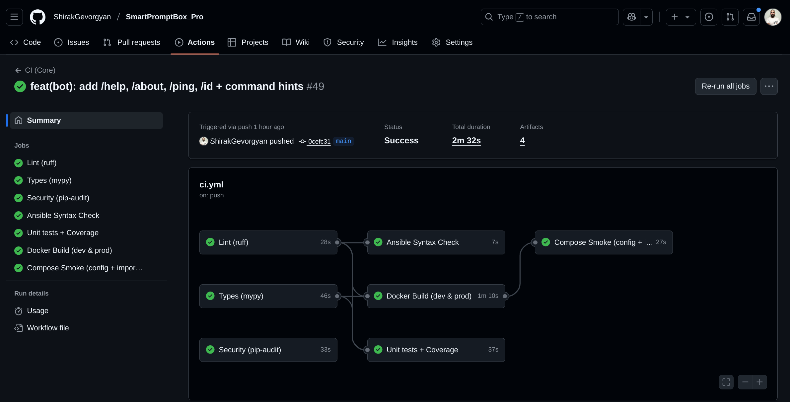

---

## CD (Self‑Hosted)
Workflow: `.github/workflows/cd.yml`

- **Trigger**: on CI success (e.g., pushes to `main`).
- **Steps**: self‑hosted runner → pull latest → refresh env (GitHub Secrets) →
  `docker compose -f devops/compose/docker-compose.prod.yml up -d --build` → healthcheck.
- **Notifications**: Telegram message confirming `RUNNING (healthy)` with a **View CD logs** link.

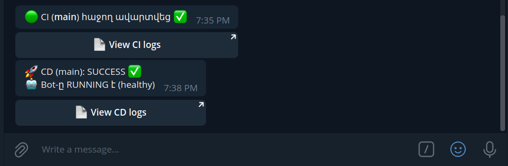

---

## DevOps / Ansible Deploy
- Playbook: `devops/ansible/playbooks/deploy.yml`
- Inventory: `devops/ansible/inventory/hosts.ini`
- Role: `roles/deploy_app/tasks/main.yml` (Docker login/build/pull, Compose up)
- CI performs an **Ansible Syntax Check**; CD runs the actual deployment.

---

## Screenshots
**Home / Menus**

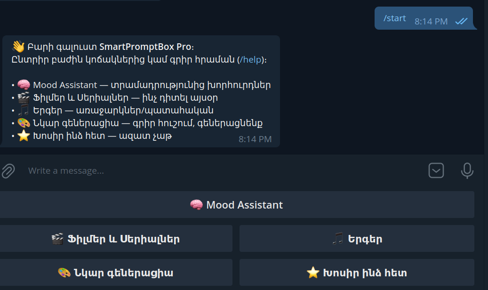
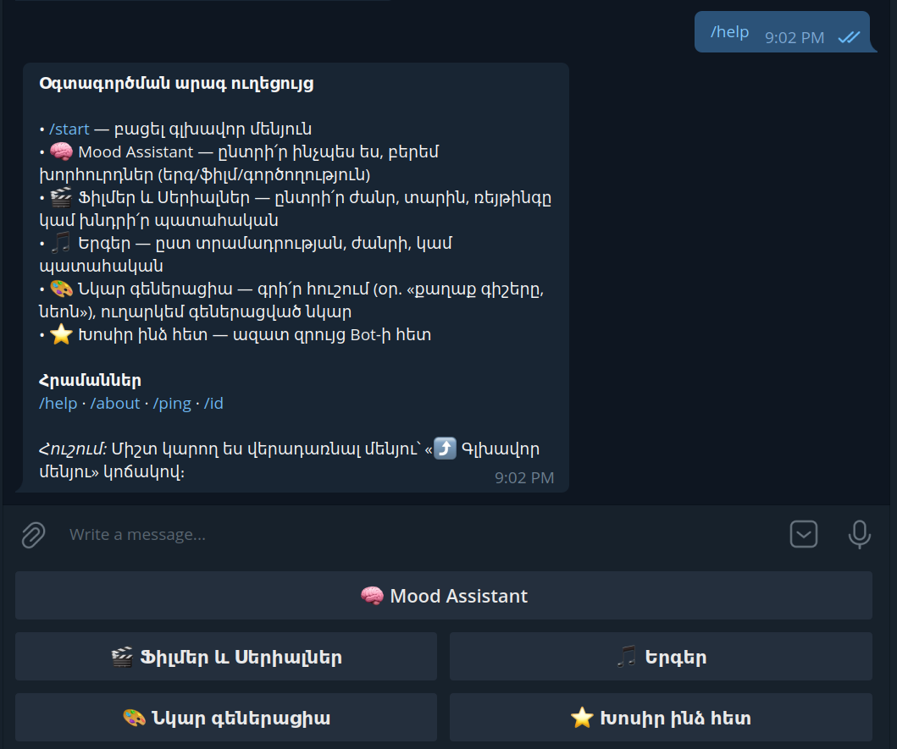

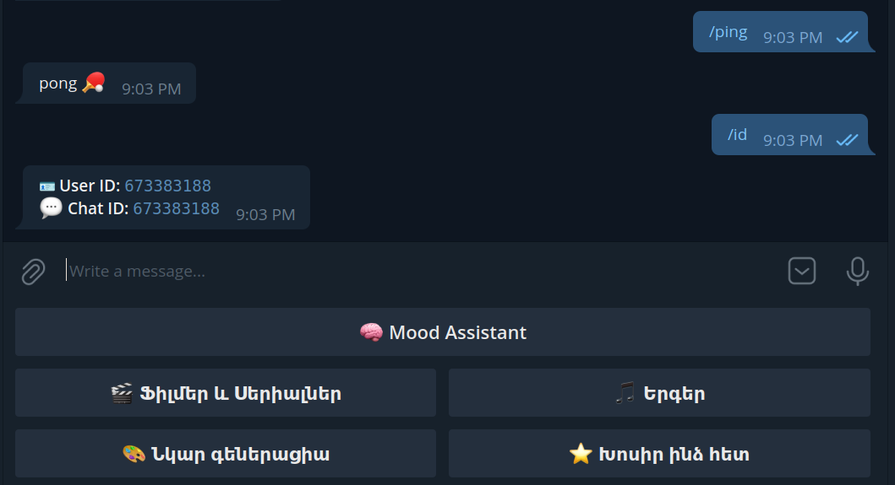

**Mood Assistant → Choices → Results**

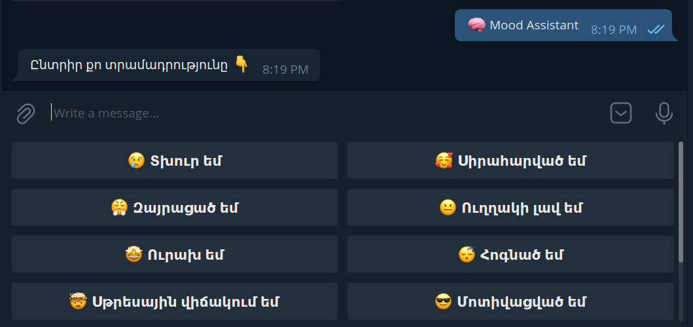
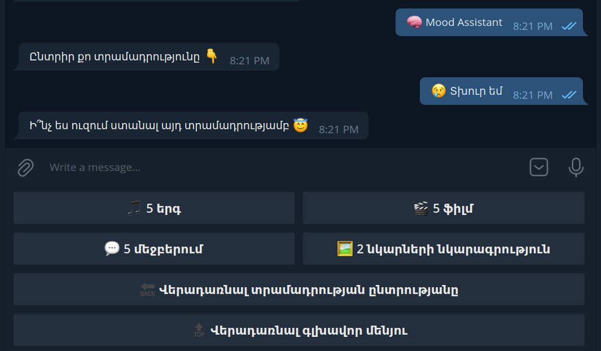
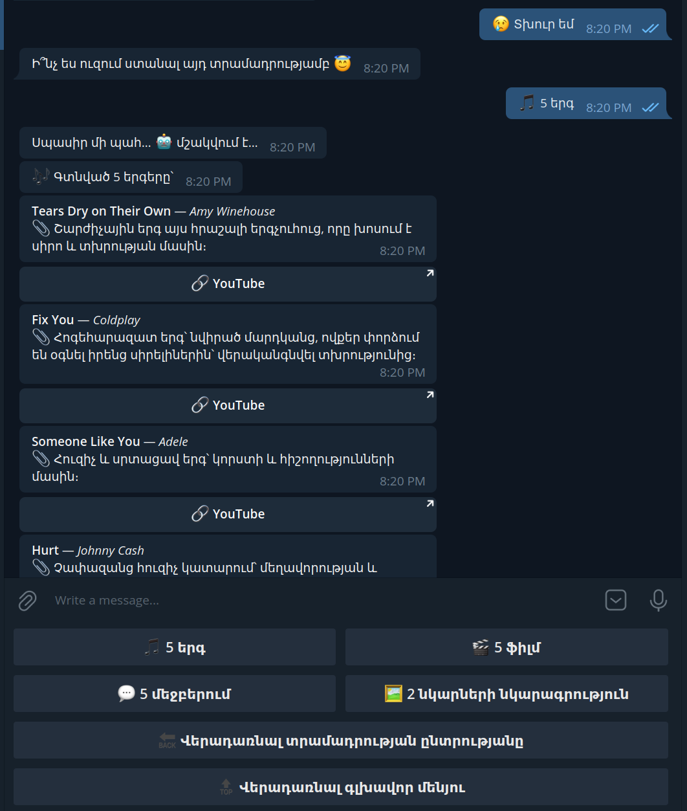

**Songs**

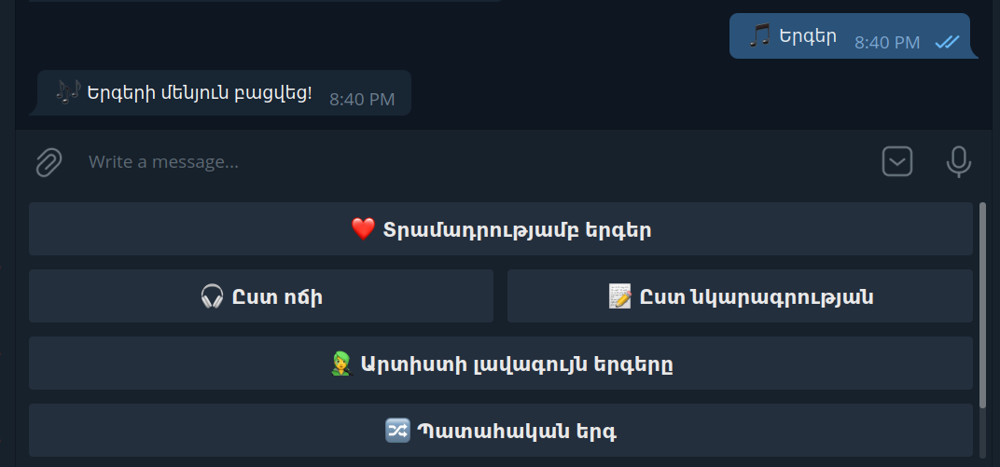
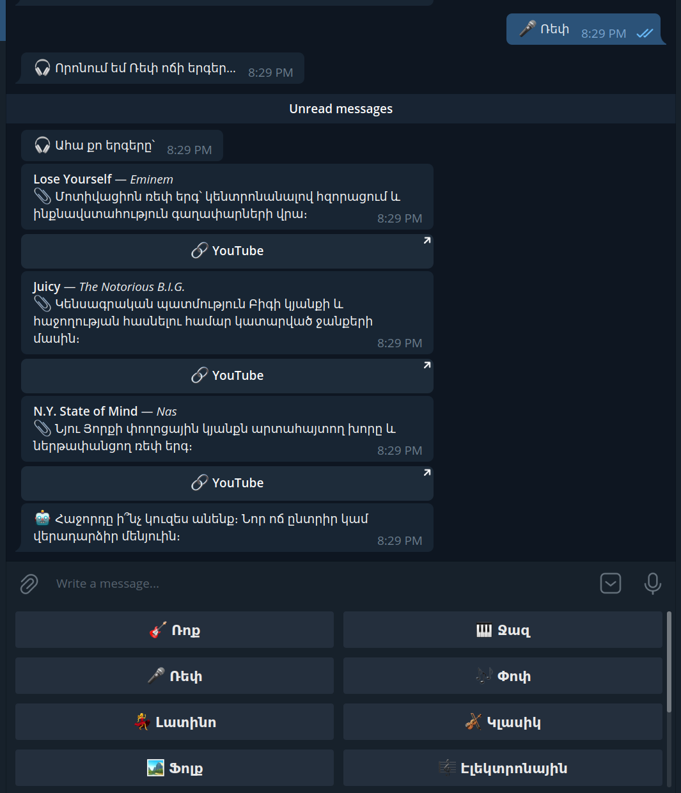

**Movies & Series**

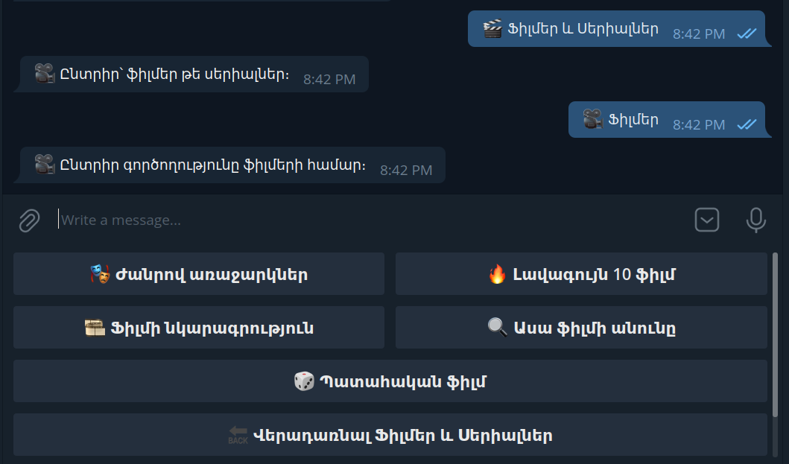
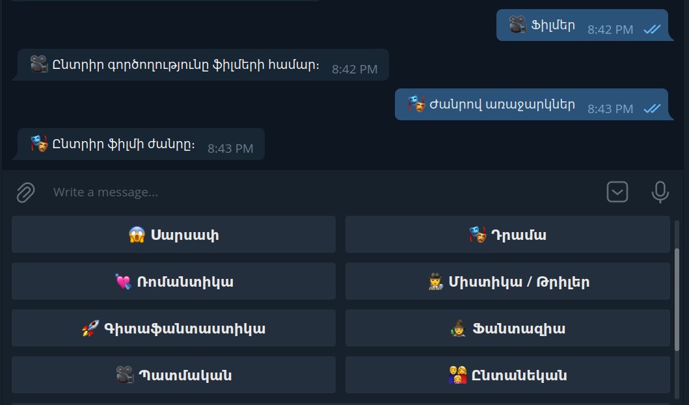


**Image Generation**

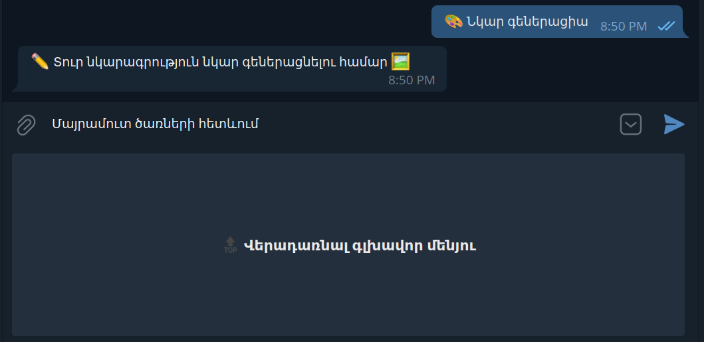
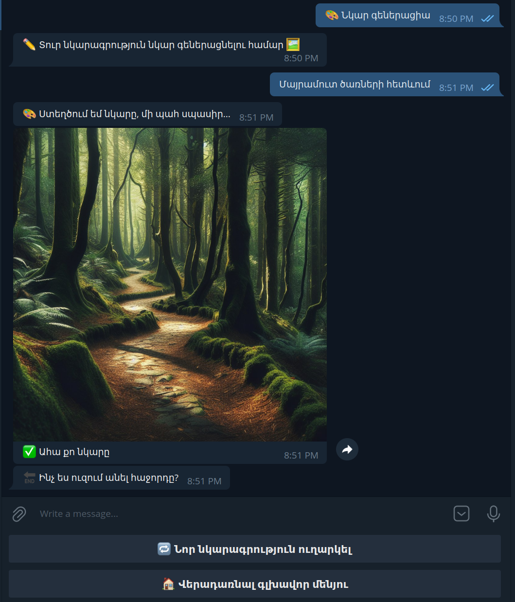

**GPT Chat + Clearing**

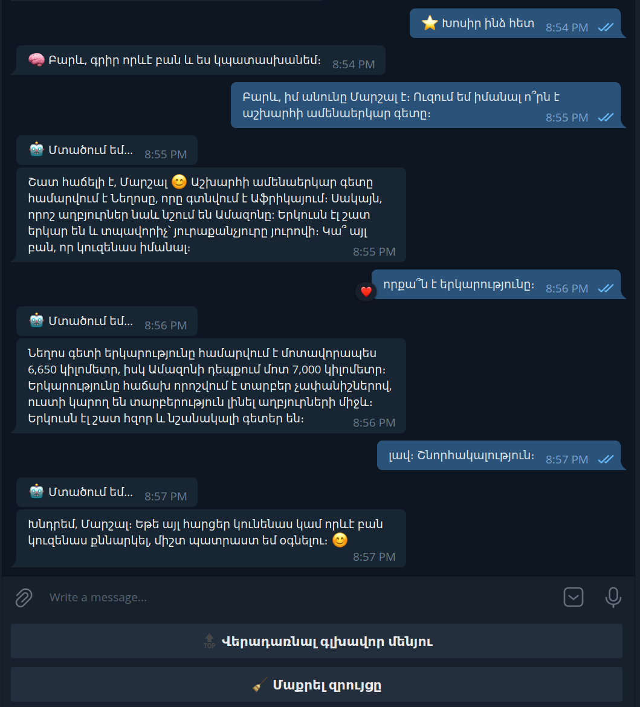
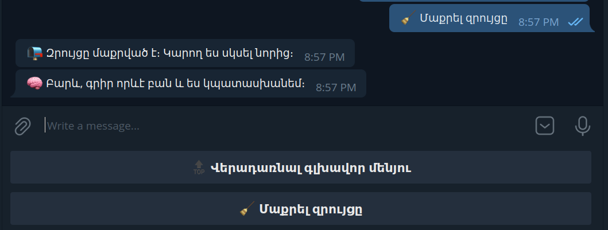

---

## Data Layer
- Default `DATABASE_URL`: `sqlite:///db/memory.db` (mounted volume)
- Core model: `UserMemory(id, user_id, role, content, user_name, bot_name, last_mood, history)`
- `memory_service.py` handles loading/saving and optional summarization to keep context fresh.
- `db_session_tracker.py` provides visibility into DB sessions during testing.

---

## FSM States
- `app/states/gpt_states.py` defines the conversation flow states used by handlers.

---

## Health / Smoke
- `utils/trivial_check.py` is used by smoke tests and health probes.

---

## Middlewares
- `errors.py` — catch‑all with user‑friendly messages
- `logging.py`, `request_id.py` — correlation IDs and structured logs for traceability

---

## Security Notes
- Keep secrets out of VCS; use **GitHub Secrets** and local `.env` (git‑ignored).
- Tokens are read from env at startup; do not print them in logs.
- Input sanitization is covered by tests; avoid rendering untrusted HTML.
- Rate‑limit heavy actions at the bot level (Telegram limits apply as well).

---

## Versioning & Releases
- **Versioning**: Semantic Versioning (**SemVer**) — `MAJOR.MINOR.PATCH`.
- **Source of truth**: bump version in `app/meta.py` (used by `/about`). Optionally mirror in `.env` `BOT_VERSION`.
- **Tag & release**:
  ```bash
  git commit -m "chore(release): vX.Y.Z"
  git tag -a vX.Y.Z -m "release vX.Y.Z"
  git push origin main --tags
  ```
  Create a GitHub Release with notes (highlights, breaking changes).
- **Deploy**: CD auto‑deploys `main` on CI success; prefer PR → squash merge → release tag.

---

## Troubleshooting
- **Invalid bot token** → `/help` does not respond; confirm `TELEGRAM_BOT_TOKEN` and restart.
- **Wrong chat id** → CI/CD messages not delivered; verify `TELEGRAM_CHAT_ID` with `/id`.
- **OpenAI rate limit / 429** → backoff and retry; consider reducing concurrency.
- **Image generation fails** → ensure the image adapter is enabled and API key present.
- **Docker build fails** → run `docker build` locally; check network and base image tags.
- **Unhealthy container** → inspect healthcheck logs; run `docker logs` and `docker inspect`.
- **See live logs**
  ```bash
  docker compose -f devops/compose/docker-compose.prod.yml logs -f --tail=200
  ```
- **Mask secrets in logs**
  ```bash
  docker logs -f compose-app-1 | sed -E 's/(sk-[A-Za-z0-9_-]+)/sk-*****/g'
  ```
- **Compose config sanity**
  ```bash
  docker compose -f devops/compose/docker-compose.prod.yml config
  ```

---

## FAQ
- **How do I run only unit tests?** → `pytest tests/unit -q`
- **Where are screenshots?** → `docs/images/` used directly by this README.
- **How do I switch LLM models or prompts?** → edit `app/llm/assistant.py` and related prompt utilities; keep tests green.
- **How do I reset chat memory?** → use the **Clear chat** command or delete the DB file in `./db/` (dev only).

---

## Roadmap
- One‑line Dockerfile healthcheck improvement ✅
- Pre‑commit hooks (ruff + mypy + pytest)
- Observability (basic metrics/tracing)
- Coverage badge and Codecov integration

---

## Contributing
Pull requests and issues are welcome. Please:
1. Open a descriptive issue or PR.
2. Run `ruff`, `mypy`, and the full test suite locally.
3. Keep commits small and well‑described.

---

## License
This project is licensed under the **MIT License**. See [LICENSE](./LICENSE) for details.
